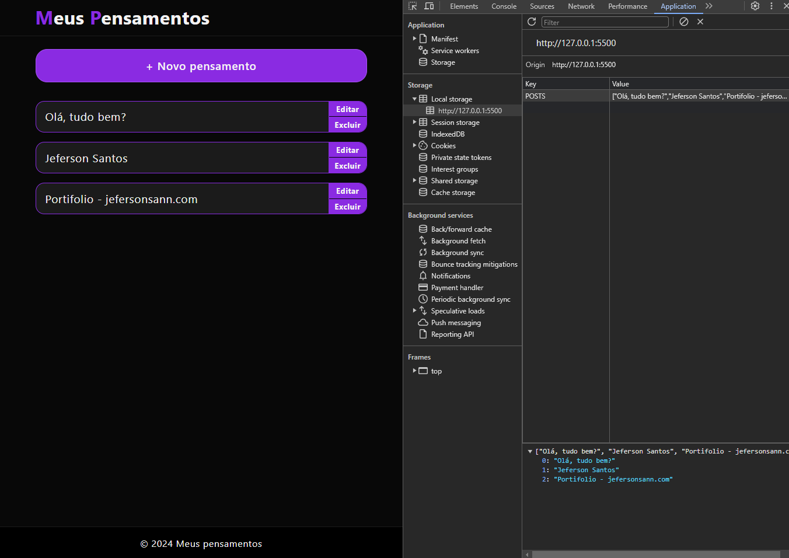

# Meus Pensamentos

Um app para colocar praticar base do HTML, CSS e JavaScript.
Nele tem uma manipulação de formulário, onde o valor digitado é resgatado e salvo no localStorage e renderizado em tela podendo fazer alteração apenas do elemento selecionado ou excluir.

## Demonstração



## Funcionalidades

- Manipulação de formulário
- Salvamento no local Storage
- Renderização em tela
- Editar item selecionado
- Excluir item selecionado

## Rodando localmente

Clone o projeto

```bash
  git clone meus-pensamentos-js
```

Entre no diretório do projeto

```bash
  cd meus-pensamentos-js
```

## Autor

[jefersonsann.com](https://jefersonsann.com)
